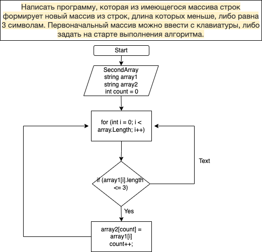

# Задача: 
Написать программу, которая из имеющегося массива строк формирует новый массив из строк, длина которых меньше, либо равна 3 символам. Первоначальный массив можно ввести с клавиатуры, либо задать на старте выполнения алгоритма. При решении не рекомендуется пользоваться коллекциями, лучше обойтись исключительно массивами.

# Описание алгоритма:
Объявляем два массива. Затем метод, в котором цикл соразмерный длине массива, внутри цикла идет проверка условия (меньше или равно 3), если да, то элемент первого массива заносится в count элемент второго массива. Переменная сount чтобы поочередно закидывать из первого массива во второй. После присвоения увеличивается переменная count на 1 и возвращается к циклу for в котором увеличивается на 1. Далее проверяется так до конца.

